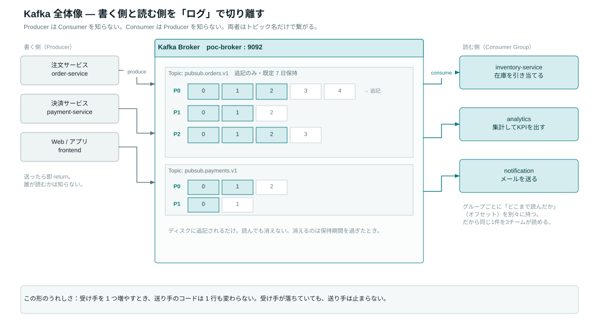
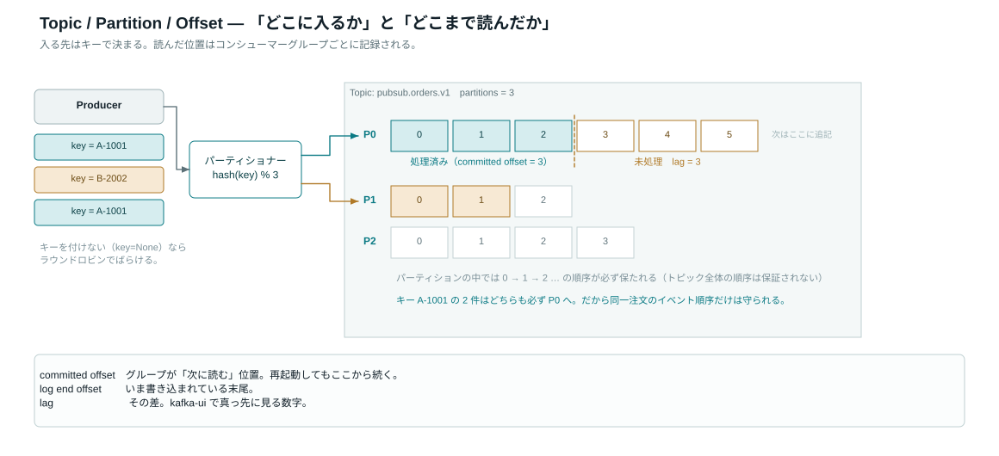
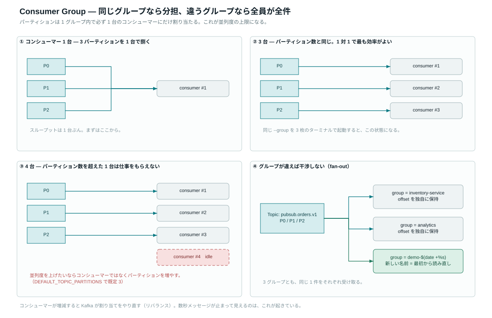
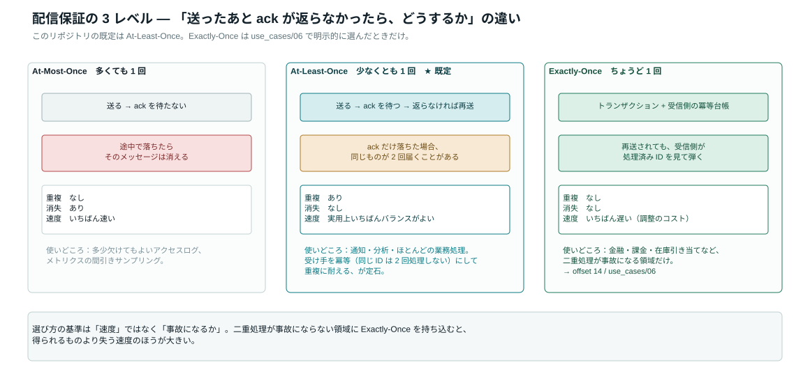
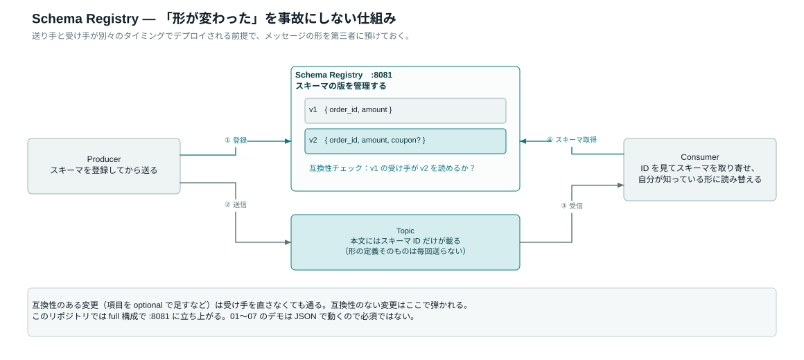
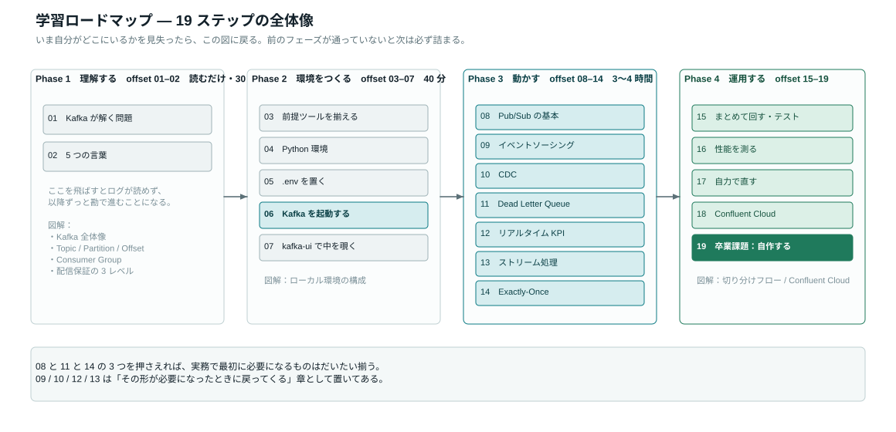

# Kafka 基本概念ガイド

> このドキュメントは「Kafka を初めて触る人」向けです。
> 概念を理解してから実際にコードを動かすと、何が起きているか格段にわかりやすくなります。

---

## 全体像：まず「郵便局」のイメージで捉える

```
          [手紙を書く人]         [郵便局]         [手紙を読む人]
           Producer           Kafka Broker          Consumer

  注文サービス ──→ publish ──→ [ Topic: orders ] ──→ subscribe ──→ 在庫サービス
                                                              ──→ 通知サービス
                                                              ──→ 分析サービス
```

**Producer（プロデューサー）** はメッセージをトピックに送ります。
**Consumer（コンシューマー）** はトピックからメッセージを受け取ります。
**Broker（ブローカー）** は Kafka サーバー本体で、メッセージを保管します。

---



> Producer と Consumer は互いを知らない。両者はトピック名だけで繋がる。　—　[原寸 SVG](diagrams/01-kafka-overview.svg) / [編集用 draw.io](diagrams/01-kafka-overview.drawio)

## 1. Topic（トピック）— 「郵便ポストの種類」

**トピック** はメッセージの入れ物です。「注文」「支払い」「在庫変更」など、テーマごとに作ります。

```
┌──────────────────────────────────────────┐
│  Topic: orders                            │
│  ┌─────────────────────────────────────┐ │
│  │ msg1 | msg2 | msg3 | msg4 | msg5 …  │ │
│  └─────────────────────────────────────┘ │
└──────────────────────────────────────────┘
```

- メッセージは**追記のみ**（既存メッセージを書き換えることはできない）
- 保存期間はデフォルト 7 日間（設定変更可能）
- トピック名は `pubsub.orders.v1` のように `{機能}.{エンティティ}.{バージョン}` で命名します

**このリポジトリで体験できるユースケース**: 全ユースケース

---

## 2. Partition（パーティション）— 「窓口を増やして並列処理」

トピックは内部的に複数の **パーティション** に分割できます。
パーティションを増やすと、複数のコンシューマーが同時並列でメッセージを処理できます。

```
  Topic: orders（パーティション数 = 3）

  Partition 0: [order_A] [order_D] [order_G] ...
  Partition 1: [order_B] [order_E] [order_H] ...
  Partition 2: [order_C] [order_F] [order_I] ...
```

**キー（Key）** を指定してメッセージを送ると、同じキーのメッセージは常に同じパーティションに入ります。
例: 注文IDをキーにすると、同じ注文のイベントが必ず順番通りに処理されます。

**このリポジトリで体験できるユースケース**: [02_event_sourcing](../use_cases/02_event_sourcing/)（aggregate_id でキー付け）

---

## 3. Offset（オフセット）— 「メッセージの連番」

各パーティション内のメッセージには **0 から始まる連番（オフセット）** が振られます。

```
  Partition 0:
  offset: 0       1       2       3       4
          [msg A] [msg B] [msg C] [msg D] [msg E]
                                   ↑
                          Consumer はここまで読んだ（offset=2 をコミット済み）
```

コンシューマーは「どこまで読んだか（コミット済みオフセット）」を記録します。
再起動しても**続きから**読み始められます。

> 💡 **ポイント**: Kafka は「どのメッセージを誰が読んだか」を管理します。
> 読んだメッセージを削除するのではなく、「どこまで読んだか」を別に記録する仕組みです。

---



> 「どこに入るか」はキーで決まり、「どこまで読んだか」はグループごとに記録される。　—　[原寸 SVG](diagrams/02-topic-partition-offset.svg) / [編集用 draw.io](diagrams/02-topic-partition-offset.drawio)

## 4. Consumer Group（コンシューマーグループ）— 「チームで分担」

複数のコンシューマーを **グループ** にまとめると、パーティションが自動的に分担されます。

```
  Topic: orders（パーティション 0, 1, 2）
  Consumer Group: inventory-service

  Partition 0 ──→ Consumer A
  Partition 1 ──→ Consumer B
  Partition 2 ──→ Consumer C

  ※ 各メッセージはグループ内で 1 回だけ処理される
```

グループが **異なれば**、同じメッセージを全グループが受け取れます（ファンアウト）:

```
  orders ──→ [Group: inventory]  全メッセージを受信
         ──→ [Group: notification] 全メッセージを受信
         ──→ [Group: analytics]   全メッセージを受信
```

**このリポジトリで体験できるユースケース**: [01_basic_pubsub](../use_cases/01_basic_pubsub/)（`--group` オプションで切り替え）

---



> パーティションは 1 グループ内で必ず 1 台にだけ割り当たる。これが並列度の上限。　—　[原寸 SVG](diagrams/03-consumer-group.svg) / [編集用 draw.io](diagrams/03-consumer-group.drawio)

## 5. Broker（ブローカー）— 「郵便局本体」

**ブローカー** は Kafka サーバーのことです。メッセージを受け取り、パーティションに書き込み、
コンシューマーに配信する役割を担います。

本番環境ではブローカーを複数台（クラスター）動かして冗長化します。
このリポジトリでは Docker で 1 台のブローカーを起動します。

---

## 6. 配信保証レベル

Kafka には 3 種類の配信保証があります。用途に応じて使い分けます。

| 保証レベル | 説明 | 重複の可能性 | 消失の可能性 | 典型的な用途 |
|----------|------|------------|------------|------------|
| **At-Most-Once** | 最大 1 回配信 | なし | あり | ログ（多少の欠損を許容） |
| **At-Least-Once** | 最低 1 回配信 | あり | なし | 通知・分析（冪等処理で対応） |
| **Exactly-Once** | ちょうど 1 回配信 | なし | なし | 金融・課金・在庫 |

Kafka のデフォルトは **At-Least-Once** です。
`Exactly-Once` はトランザクション機能を使って実現します。

**このリポジトリで体験できるユースケース**: [06_exactly_once](../use_cases/06_exactly_once/)

---



> 選び方の基準は速度ではなく「二重処理が事故になるか」。　—　[原寸 SVG](diagrams/12-delivery-semantics.svg) / [編集用 draw.io](diagrams/12-delivery-semantics.drawio)

## 7. Schema Registry（スキーマレジストリ）

メッセージの形式（JSON の構造など）を一元管理する仕組みです。

```
Producer ──→ [Schema Registry] ──→ スキーマを登録・検証
         ──→ [Kafka Topic]     ──→ スキーマID + データを送信

Consumer ←── [Schema Registry] ←── スキーマIDで形式を取得
         ←── [Kafka Topic]     ←── データを受信・デシリアライズ
```

生産者と消費者が「どんな形式でデータを送り合うか」を共有・強制できます。
このリポジトリでは JSON をそのまま使っていますが、Schema Registry を `localhost:8081` で起動しています。

---



> 送り手と受け手が別々にデプロイされる前提で、メッセージの形を第三者に預けておく。　—　[原寸 SVG](diagrams/15-schema-registry.svg) / [編集用 draw.io](diagrams/15-schema-registry.drawio)

## 8. ZooKeeper（ズーキーパー）

Kafka クラスターの管理情報（どのブローカーがリーダーか、など）を保持する分散調整サービスです。
Kafka 3.0 以降は KRaft モードで ZooKeeper なしでも動きますが、
このリポジトリは Confluent Platform 7.5（Kafka 3.5 ベース）で ZooKeeper を使っています。

> 💡 **初学者向けメモ**: ZooKeeper は「裏方」なので、普段は意識しなくて大丈夫です。

---

## 概念マップ

```
                        Kafka Cluster
  ┌──────────────────────────────────────────────────────┐
  │                                                        │
  │  ┌─── Topic: orders ───────────────────────────────┐  │
  │  │  Partition 0: [0: msg] [1: msg] [2: msg] ...   │  │
  │  │  Partition 1: [0: msg] [1: msg] [2: msg] ...   │  │
  │  │  Partition 2: [0: msg] [1: msg] [2: msg] ...   │  │
  │  └─────────────────────────────────────────────────┘  │
  │                                                        │
  │  ┌─── Topic: payments ─────────────────────────────┐  │
  │  │  Partition 0: [0: msg] [1: msg] ...             │  │
  │  └─────────────────────────────────────────────────┘  │
  │                                                        │
  └──────────────────────────────────────────────────────┘
       ↑ produce                           consume ↓
  ┌──────────┐                     ┌────────────────────┐
  │ Producer │                     │  Consumer Group    │
  │  (注文   │                     │  inventory-service │
  │  サービス)│                     │  [Consumer A] [B]  │
  └──────────┘                     └────────────────────┘
```

---



> site/index.html のハンズオンはこの順に進む。　—　[原寸 SVG](diagrams/14-learning-path.svg) / [編集用 draw.io](diagrams/14-learning-path.drawio)

## 次のステップ

概念を理解したら、実際に動かしてみましょう:

1. [docs/getting-started.md](getting-started.md) — 環境構築
2. [use_cases/01_basic_pubsub/](../use_cases/01_basic_pubsub/) — 最初のデモ
3. [docs/use-cases-guide.md](use-cases-guide.md) — 全ユースケースの詳細解説
